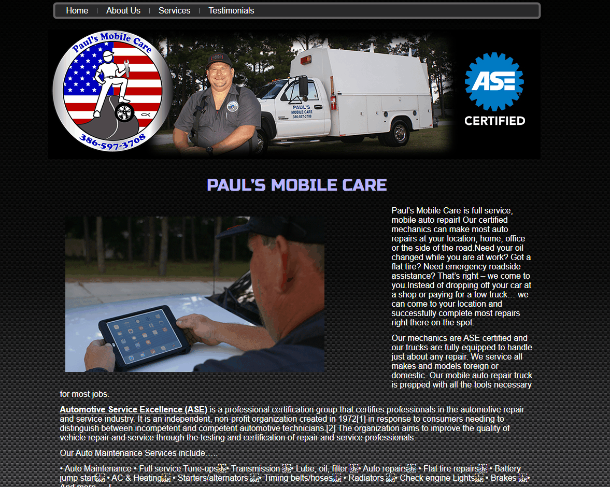

# AutoRepair
 
A simple project to take a website that is out of current web design standards and modernize it using **HTML** and **SASS**. In this project, I did the initial design in **Figma** and then translated that into code. 

## Target Website: 
The website is severely outdated and has many design issues. I can see that this was done very quickly without any effort in maximizing UX design practices such as simple formatting or color branding. Also, many repetitive words are used throughout the document. Other than to phone for an appointment, a call to action is not presented to the user.  There should be in a single scrollable format rather than multiple pages since there is extraordinarily little information provided about the service. 
      

         

## Approach Taken

Before initial wireframe sketching, I looked at the competition's website design and pulled in some designs to Figma for inspiration. I then created a **low-level  
mockup design** as well as a style tile frame that has a collection of images, icons, colors, and typography to use. I then created a **high-level design** that I would match  
with code. 

https://www.figma.com/file/VeKPlrTggvYsqlnOAl1Z0n/Mobile-Repair-Project?node-id=3%3A2

         

## Modernized Desktop view 

         

## Modernized Mobile view

         

# Installation process  
To install and view live on your local machine,  
Fork the existing project and install the latest  
Node.js. Install gulp, then npm install SASS.  
Use the terminal and traverse to the project folder.  
Then enter in **gulp** as the command word to run  
the local server and view the webpage. 
