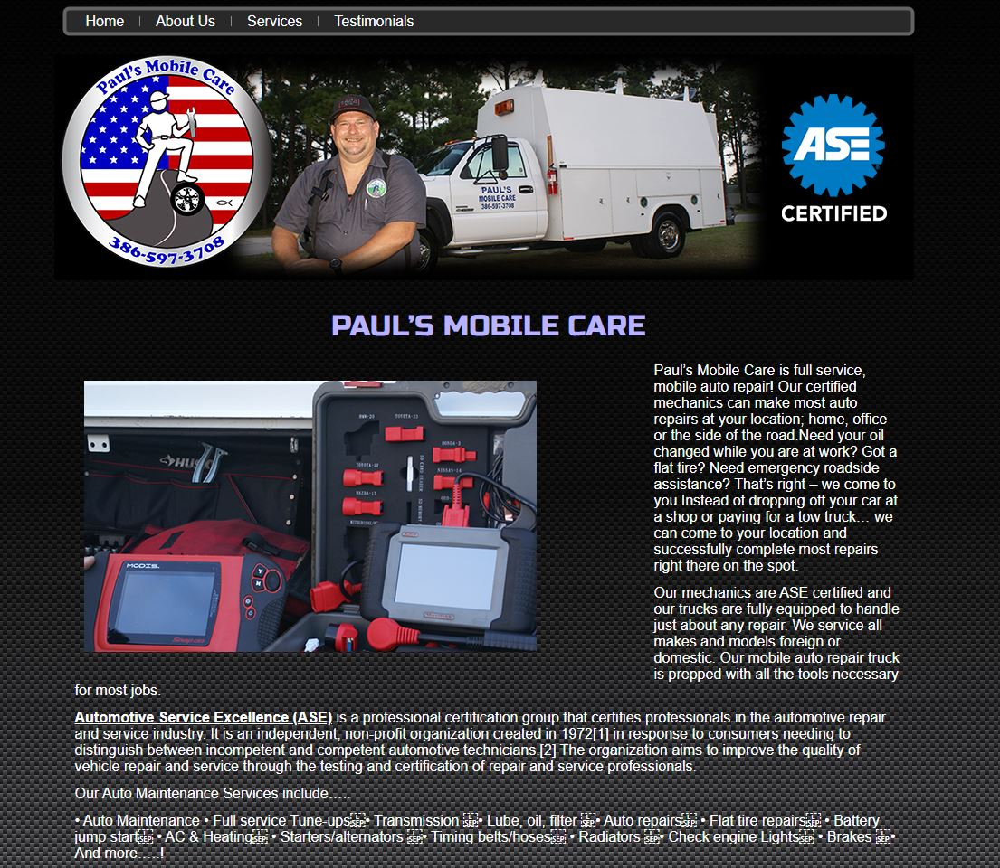

# AutoRepair
 
A simple project to take a website that is out of current standards and modernize it using HTML and SASS. In this project, I did the initial design in Figma adn then translated that into code. 

## Target Website: 
 

## Modernized Desktop view (work in progress)  

   

# Installation process  
To install and view live on your local machine,  
Fork the exhisting project and install the latest  
Node.js. Install gulp, then npm install SASS.  
Use the terminal and traverse to the project folder.  
